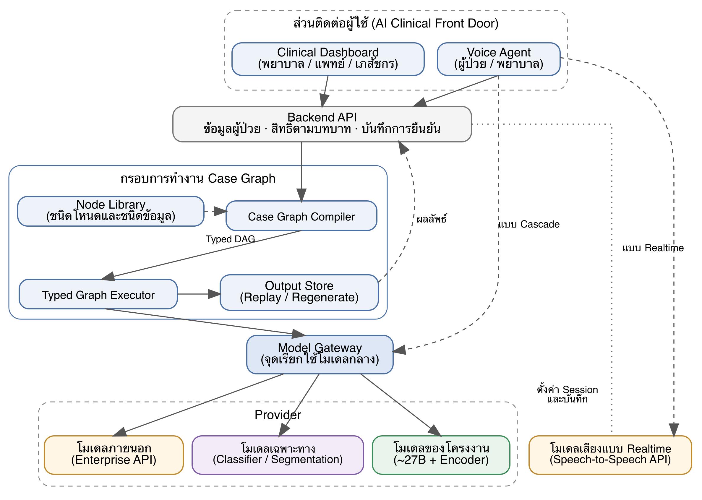
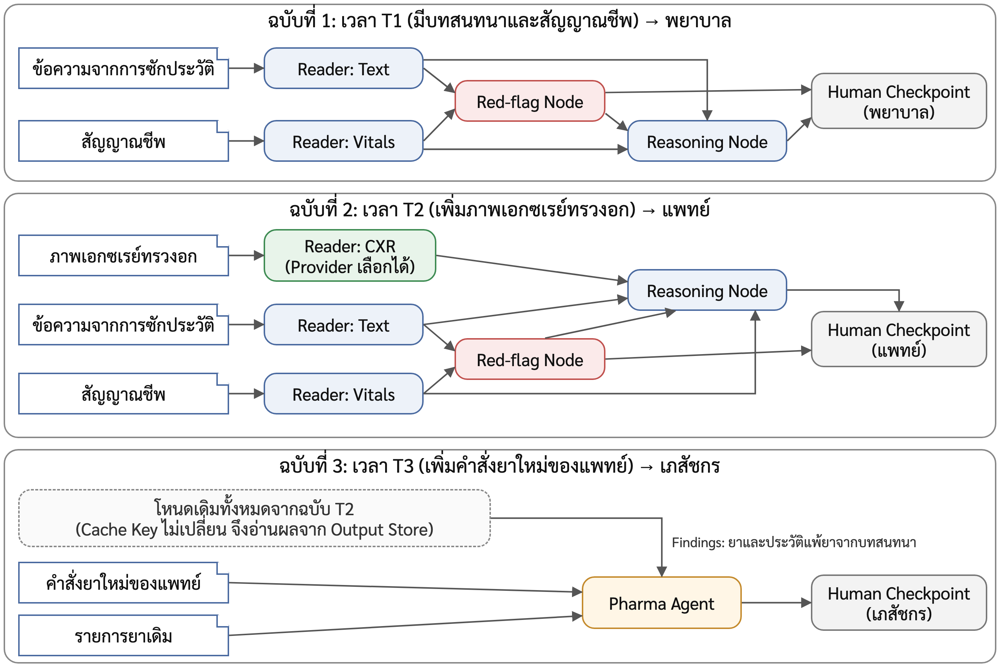
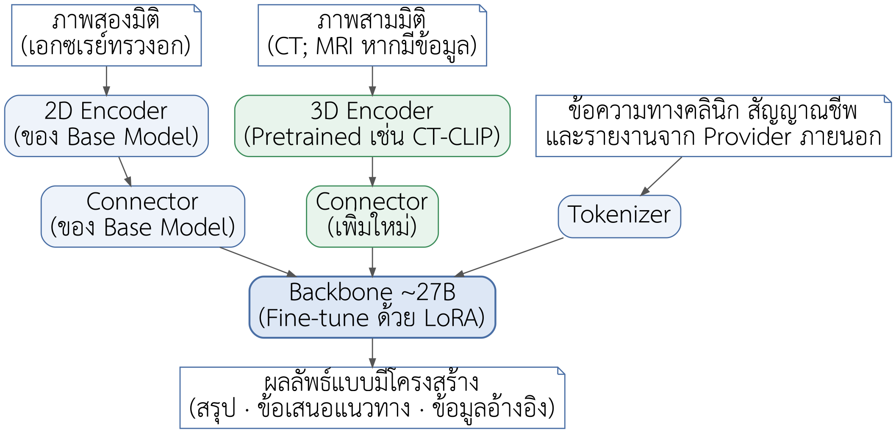
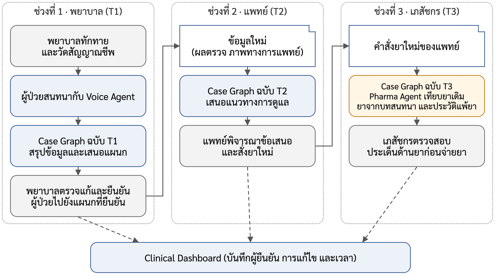

# Project Proposal v9.6 (source of truth)

> แปลงจาก `Project Proposal v2 Trimmed Revised v9.6.docx` (ฉบับที่ส่งจริง 2 ต.ค. 2026) เมื่อ 2026-10-03 ด้วย python-docx. ตารางเป็น Markdown table; ช่องที่ระบายสีใน Gantt แทนด้วย ■; ภาพ 3.1–3.4 อยู่ใน `docs/figures/`. ต้นฉบับ .docx/.pdf อยู่ใน `docs/proposal/` (gitignored). ฉบับ v8 ดูได้จาก git history.

หัวข้อโครงงานวิศวกรรมคอมพิวเตอร์
หลักสูตรวิศวกรรมศาสตรบัณฑิต สาขาวิชาวิศวกรรมคอมพิวเตอร์
ปีการศึกษา 2569
ชื่อโครงงาน: Case-Adaptive Medical Multimodal Foundation Model for Clinical Reasoning and Care-Pathway Decision Support
สมาชิกกลุ่ม
- นายจักรภัทร บรรจงรักษา	66070501008	jakkapat.bunj@kmutt.ac.th
- นางสาวธัญรดา ตั้งวีระพรพงศ์	66070501025	thanrada.tung@kmutt.ac.th
- นายภูริณัฐ พลอาสา	66070501042	phurinat.pola@kmutt.ac.th
- นายธนาพล โพพิศ	66070501085	thanapol.popi@kmutt.ac.th
- นางสาวสุปรียา น่วมขยัน	66070501087	supreeya.nuam@kmutt.ac.th
ที่ปรึกษา
ดร.สัญญ์สิริ ธารประดับ
By signing this, I hereby acknowledge that I have read the proposal and approved this project.
Advisor name: ________________________________
By DATE: ________________________________

# บทที่ 1
**บทนำ**

## 1.1 ที่มาและความสำคัญของปัญหา
การประเมินผู้ป่วยในระยะแรกต้องอาศัยข้อมูลจากหลายแหล่ง ได้แก่ อาการสำคัญ ประวัติการเจ็บป่วย สัญญาณชีพ ผลตรวจทางห้องปฏิบัติการ และภาพทางการแพทย์ ข้อมูลเหล่านี้มีรูปแบบต่างกันและพร้อมใช้งานในเวลาต่างกัน บุคลากรทางการแพทย์จึงมักต้องประเมินผู้ป่วยจากข้อมูลที่ยังไม่ครบ และปรับการประเมินเมื่อมีข้อมูลใหม่เข้ามา แนวคิด Medical Foundation Model มุ่งพัฒนาโมเดลที่รองรับข้อมูลหลายรูปแบบและนำไปใช้ได้กับหลายงาน [1] อย่างไรก็ตาม การนำโมเดลลักษณะนี้ไปใช้จริงยังต้องสอดคล้องกับข้อมูลที่ผู้ป่วยแต่ละรายมีอยู่และกระบวนการทำงานของบุคลากร
ในขั้นตอนการรับผู้ป่วย พยาบาลต้องรวบรวมข้อมูลจากผู้ป่วยหรือญาติ ตรวจสอบความถูกต้อง และสรุปข้อมูลสำคัญเพื่อส่งต่อให้แพทย์ ข้อมูลที่ได้อาจยังไม่ครบหรือเปลี่ยนแปลงระหว่างการซักประวัติ ขณะเดียวกัน ข้อมูลด้านยาอาจมาจากหลายแหล่ง เช่น คำบอกเล่าของผู้ป่วย รายการยาเดิม และคำสั่งยาใหม่ของแพทย์ ซึ่งอาจไม่ครบถ้วนหรือขัดแย้งกัน เภสัชกรจึงต้องทวนรายการยาและสื่อสารกับผู้เกี่ยวข้องก่อนจ่ายยา [2], [3]
การนำข้อมูลหลายรูปแบบมาใช้ร่วมกันยังต้องคำนึงถึงความสัมพันธ์ระหว่างผู้ป่วย การเข้ารับบริการ และเวลาที่ข้อมูลแต่ละรายการพร้อมใช้งาน แม้ข้อมูลเวชระเบียนและภาพเอกซเรย์ในชุดข้อมูลกลุ่ม MIMIC จะเชื่อมโยงกันได้ในระดับผู้ป่วย [4], [5], [6] แต่หากไม่ควบคุมเวลาของข้อมูล โมเดลอาจใช้ข้อมูลที่ยังไม่พร้อมใช้งาน ณ เวลาประเมิน นอกจากนี้ ระบบส่วนใหญ่ส่งข้อมูลทั้งหมดเข้าโมเดลเดียวด้วยขั้นตอนเดียวกันสำหรับผู้ป่วยทุกราย จึงตรวจสอบได้ยากว่าผลลัพธ์มาจากข้อมูลส่วนใด และเปลี่ยนโมเดลเฉพาะบางขั้นตอนได้ยาก
โครงงานนี้จึงเสนอแนวคิด Case-Adaptive โดยพัฒนากรอบการทำงาน Case Graph ที่สร้างกราฟการประมวลผลแบบ Typed DAG (Typed Directed Acyclic Graph) สำหรับผู้ป่วยแต่ละรายจากข้อมูลที่มี ณ เวลาประเมิน แต่ละโหนดในกราฟทำหน้าที่ตามชนิดที่กำหนด เช่น อ่านภาพเอกซเรย์ อ่านภาพ CT หรือสรุปสัญญาณชีพ และสามารถเลือก Provider ของโหนดได้ ทั้งโมเดลของโครงงาน โมเดลภายนอกผ่าน API หรือโมเดลเฉพาะทาง ระบบบันทึกผลลัพธ์ทุกโหนด จึงตรวจสอบย้อนกลับได้ว่าผลลัพธ์มาจากข้อมูลส่วนใด และทำ Ablation เพื่อวัดผลของข้อมูลแต่ละส่วนได้
ผลงานหลักของโครงงานคือกรอบการทำงาน Case Graph ซึ่งทำหน้าที่เชื่อมโยงข้อมูลและขั้นตอนการประมวลผลของผู้ป่วยแต่ละราย โดยสร้าง Typed DAG จากข้อมูลที่มี ณ เวลาประเมิน และเลือก Provider สำหรับแต่ละขั้นตอนตามข้อมูลที่มี พร้อมบันทึกข้อมูลเข้า ผลลัพธ์ และ Provider ที่เรียกใช้ เพื่อให้สามารถตรวจสอบย้อนหลังและ Regenerate เฉพาะส่วนที่ได้รับผลกระทบได้ โมเดล Multimodal ทางการแพทย์เป็นผลงานสำคัญอีกส่วนหนึ่ง โดยพัฒนาจาก Base Model ขนาดใหญ่แบบ Open-weight และเพิ่ม 3D Encoder พร้อม Connector สำหรับข้อมูลที่โมเดลเดิมไม่รองรับ เพื่อใช้เป็น Provider หลักของ Case Graph และประเมินความสามารถแยกตามรูปแบบข้อมูล ส่วน ระบบ AI Clinical Front Door เป็นระบบสาธิตและประเมินการนำ Case Graph ไปใช้ ในงานของพยาบาล แพทย์ และเภสัชกร ตั้งแต่การซักประวัติด้วยเสียงจนถึงการทวนรายการยา โดยผลลัพธ์ของระบบเป็นข้อมูลสนับสนุนการตัดสินใจที่บุคลากรต้องยืนยันก่อนนำไปใช้ และประเมินในสภาพแวดล้อมจำลอง

## 1.2 วัตถุประสงค์ของโครงงาน
- เพื่อพัฒนากรอบการทำงาน Case Graph ประกอบด้วย Case Graph Compiler ที่สร้าง Typed DAG สำหรับผู้ป่วยแต่ละรายจากข้อมูลที่มี ณ เวลาประเมิน และ Typed Graph Executor ที่ประมวลผลกราฟ โดยรองรับการเปลี่ยน Provider ของแต่ละโหนด และบันทึกผลลัพธ์ทุกโหนดเพื่อ Replay และ Regenerate
- เพื่อพัฒนาโมเดล Multimodal ทางการแพทย์ขนาดใหญ่แบบ Open-weight สำหรับใช้เป็น Provider ภายในของ Case Graph โดย Fine-tune จาก Base Model ให้รองรับข้อความทางคลินิก ภาพทางการแพทย์สองมิติและสามมิติ ข้อมูลตามช่วงเวลา และรายงานผลจาก Provider ภายนอก
- เพื่อพัฒนากระบวนการเตรียมข้อมูลโดยแบ่งชุดฝึก ชุดพัฒนา และชุดทดสอบตามผู้ป่วย และระบุเวลาที่ข้อมูลแต่ละรายการพร้อมใช้งาน เพื่อป้องกันการใช้ข้อมูลที่ยังไม่เกิดขึ้น ณ เวลาประเมิน
- เพื่อพัฒนาระบบ AI Clinical Front Door เป็นระบบสาธิตการใช้ Case Graph ประกอบด้วย Voice Agent สำหรับซักประวัติผู้ป่วยด้วยเสียงภาษาไทย การเสนอแผนกที่ควรเข้ารับบริการจากข้อมูลการซักประวัติให้พยาบาลยืนยัน ระบบเสนอแนวทางการดูแลพร้อมข้อมูลอ้างอิงสำหรับแพทย์ Pharma Agent สำหรับเปรียบเทียบรายการยาและเสนอประเด็นให้เภสัชกรตรวจสอบ และ Clinical Dashboard ที่กำหนดสิทธิ์ตามบทบาทผู้ใช้
- เพื่อประเมินผลของโครงงานในสภาพแวดล้อมจำลอง ได้แก่ ความถูกต้องของโมเดลแยกตามรูปแบบข้อมูล ความถูกต้องของข้อเสนอแนวทางการดูแลเมื่อใช้ Case Graph เทียบกับการส่งข้อมูลทั้งหมดเข้าโมเดลเดียวกันในคำสั่งเดียว ผลของการเปลี่ยน Provider ในโหนดเดียวกัน ความถูกต้องของข้อมูลที่ Voice Agent สกัดได้ และการแนะนำแผนก ค่า Precision และ Recall ของประเด็นด้านยาที่ Pharma Agent เสนอ และสัดส่วนการงดให้ข้อสรุปควบคู่กับความถูกต้องในกรณีที่ระบบให้ข้อสรุป

## 1.3 ขอบเขตของโครงงาน

### 1.3.1 คุณสมบัติของระบบ
กรอบการทำงาน Case Graph สร้างกราฟการประมวลผลสำหรับผู้ป่วยแต่ละรายจากข้อมูลที่มี ณ เวลาประเมิน โดยมีโหนดหลัก ได้แก่ Reader Node สำหรับอ่านข้อมูลแต่ละรูปแบบ Red-flag Node สำหรับตรวจสัญญาณอันตรายด้วยกฎที่กำหนดไว้ล่วงหน้า Reasoning Node สำหรับสรุปข้อมูลผู้ป่วยและเสนอแผนกหรือแนวทางการดูแล และ Human Checkpoint สำหรับให้บุคลากรยืนยันผลลัพธ์ โดย Red-flag Node และ Human Checkpoint เป็นโหนดบังคับที่ต้องมีในทุกกราฟ Reader Node เลือก Provider ได้หลายแบบ เช่น Encoder ของโมเดลโครงงาน โมเดลภายนอกผ่าน API และโมเดลเฉพาะทาง โดยเรียกผ่าน Model Gateway กราฟสร้างโดย Case Graph Compiler และประมวลผลโดย Typed Graph Executor ซึ่งบันทึกผลลัพธ์ทุกโหนดเพื่อ Replay และ Regenerate (หัวข้อ 3.2)
โมเดล Multimodal ทางการแพทย์ ได้จากการ Fine-tune Base Model ขนาดใหญ่แบบ Open-weight ที่รองรับภาพ โดยตั้งเป้าที่ขนาดประมาณ 27B เช่น MedGemma 27B [7] หรือ Qwen3.8-27B [8] แล้วเพิ่ม 3D Encoder พร้อม Connector และฝึก Reader ภายในสำหรับภาพเอกซเรย์ทรวงอกและภาพ CT ส่วนบริการเสียงไม่นับรวมในขนาดของโมเดล หากทรัพยากร GPU ไม่เพียงพอ จะใช้ Base Model ที่เล็กลงหรือลดขอบเขตการฝึก โดยคงรูปแบบข้อมูลเข้าและออกของ Model Gateway และรายงานขนาดโมเดล ขอบเขตการฝึก และผลการประเมินตามที่ดำเนินการจริง
Voice Agent ซักประวัติผู้ป่วยด้วยเสียงภาษาไทย โดยมีพยาบาลอยู่ด้วยและช่วยวัดสัญญาณชีพ ระบบสกัดข้อมูลสำคัญจากบทสนทนา เช่น อาการสำคัญ ระยะเวลาที่มีอาการ และประวัติการแพ้ยา ถามเพิ่มเฉพาะข้อมูลที่ยังขาด แล้วส่งข้อมูลให้ Case Graph เสนอแผนกที่ควรเข้ารับบริการให้พยาบาลยืนยัน โดยใช้แบบ Cascade เป็นหลักและรองรับแบบ Realtime เป็นทางเลือก รายละเอียดอยู่ในหัวข้อ 3.1 และ 3.5
ระบบเสนอแนวทางการดูแล เมื่อผู้ป่วยมีข้อมูลเพิ่มเติม เช่น ผลตรวจหรือภาพทางการแพทย์ ระบบสรุปข้อมูลผู้ป่วย เสนอการตรวจหรือข้อมูลที่ควรเก็บเพิ่มเติม และแนวทางการดูแลเบื้องต้นให้แพทย์พิจารณา พร้อมระบุข้อมูลที่ใช้อ้างอิงและข้อมูลที่ยังขาด โดยงดให้ข้อสรุปเมื่อข้อมูลที่จำเป็นยังไม่ครบ
Pharma Agent เป็นโหนดที่ Compiler เพิ่มเข้ากราฟเมื่อ Snapshot มีคำสั่งยาใหม่ของแพทย์ ระบบเปรียบเทียบคำสั่งยาใหม่กับรายการยาเดิม ยาที่ผู้ป่วยแจ้งระหว่างการซักประวัติ และประวัติการแพ้ยา แล้วเสนอประเด็นให้เภสัชกรตรวจสอบก่อนจ่ายยา เช่น ยาซ้ำซ้อน ขนาดหรือความถี่ไม่ตรงกัน ยาเดิมที่ไม่ปรากฏในคำสั่งยาใหม่ และยาที่ขัดกับประวัติการแพ้ยา โดยไม่แก้ไขคำสั่งยาเอง [2] ใช้กฎเป็นหลักในการตรวจสอบ โดยมีโมเดลช่วยสกัดข้อมูลและเรียบเรียงประเด็น (หัวข้อ 3.2.4)
Clinical Dashboard แสดงรายชื่อผู้ป่วยที่รอดำเนินการ ข้อมูลตามลำดับเวลา ร่างสรุป แผนกที่แนะนำ ข้อเสนอแนวทางการดูแล ประเด็นด้านยา และ Case Graph ของผู้ป่วยแต่ละราย ผู้ใช้ยืนยัน แก้ไข หรือปฏิเสธผลลัพธ์ได้ตามสิทธิ์ที่กำหนดสำหรับแต่ละบทบาท โดยระบบบันทึกผู้ดำเนินการและเวลา
ส่วนขยาย หากมีเวลาเพียงพอ โครงงานจะเพิ่มระบบสร้างเอกสารสรุปข้อมูลสุขภาพผู้ป่วย (Medical Passport) จากข้อมูลที่ผ่านการยืนยันแล้ว

### 1.3.2 ข้อมูลที่ใช้
โครงงานพิจารณาใช้ข้อมูลจากชุดข้อมูลสาธารณะ ข้อมูลจากสถานการณ์จำลอง และข้อมูลย้อนหลังจากโรงพยาบาลพันธมิตร เพื่อรองรับการพัฒนาและประเมินองค์ประกอบต่าง ๆ ของระบบ โดยมีรายละเอียดดังนี้
ข้อมูลจากชุดข้อมูลสาธารณะ
- MIMIC-IV [4] และ MIMIC-IV-Note [9] สำหรับข้อมูลเวชระเบียน ผลตรวจทางห้องปฏิบัติการ คำสั่งยา บริการทางคลินิกที่รับดูแลผู้ป่วย (services) และบันทึกทางคลินิก
- MIMIC-IV-ED [10] สำหรับข้อมูลแผนกฉุกเฉิน ได้แก่ อาการสำคัญ สัญญาณชีพแรกรับ รายการยาที่ผู้ป่วยใช้ก่อนมาโรงพยาบาล (medrecon) ยาที่จ่ายในแผนกฉุกเฉิน (pyxis) และผลการจำหน่ายผู้ป่วย
- MIMIC-CXR [5] สำหรับภาพเอกซเรย์ทรวงอกพร้อมรายงาน ซึ่งเชื่อมโยงกับผู้ป่วยใน MIMIC-IV
- CT-RATE [11] สำหรับภาพ CT ทรวงอกแบบสามมิติพร้อมรายงาน
- BraTS [12] สำหรับภาพ MRI สมองพร้อม Label สำหรับ Segmentation ของเนื้องอก ใช้ทดสอบ Provider แบบ Segmentation ของ Reader: CT/MRI
- ข้อมูลสำหรับการประเมิน Voice Agent
- บทสนทนาภาษาไทยจากการแสดงบทบาทผู้ป่วยในสถานการณ์จำลองตามสคริปต์ที่คณะผู้จัดทำเขียนร่วมกับผู้เชี่ยวชาญ (ไม่ใช้ข้อมูลกลุ่ม MIMIC) พร้อมเสียงและ Transcript ที่ตรวจทานแล้ว สำหรับประเมิน Voice Agent
ข้อมูลจากโรงพยาบาลพันธมิตร
สมาชิกโครงงานอยู่ระหว่างขอ Credentialed Access ผ่าน PhysioNet เพื่อเข้าถึงชุดข้อมูลกลุ่ม MIMIC นอกจากนี้ คณะผู้จัดทำอยู่ระหว่างประสานงานขอใช้ข้อมูลย้อนหลังประมาณ 3 เดือนจากโรงพยาบาลพันธมิตร โดยข้อมูลที่คาดว่าจะได้รับประกอบด้วย
- ข้อมูลพื้นฐานและสัญญาณชีพของผู้ป่วย เช่น น้ำหนัก ส่วนสูง และความดันโลหิต
- เสียงสนทนาระหว่างพยาบาลกับผู้ป่วยในขั้นตอนการซักประวัติ
- ภาพ CT และ MRI
- รายการยาที่แพทย์สั่งและผลการตรวจสอบของเภสัชกร ซึ่งต้องทำ Annotation เพิ่มเติมก่อนใช้เป็น Label
- ข้อมูลผู้ป่วยที่เข้ารับบริการมากกว่า 1 ครั้งในช่วงเวลาดังกล่าว
การใช้ข้อมูลจากโรงพยาบาลพันธมิตรขึ้นอยู่กับข้อตกลงการใช้ข้อมูล การอนุมัติด้านจริยธรรม และคุณภาพของข้อมูล
แผนการดำเนินงานกรณีข้อมูลหรือสิทธิ์เข้าถึงไม่พร้อม
หากได้รับข้อมูลจากโรงพยาบาลล่าช้าหรือไม่ได้รับข้อมูล โครงงานจะใช้ชุดข้อมูลสาธารณะที่ได้รับสิทธิ์และข้อมูลจากสถานการณ์จำลองตามแผนหลักและหากสิทธิ์เข้าถึงข้อมูลกลุ่ม MIMIC ล่าช้า โครงงานจะเริ่มพัฒนาและทดสอบโมเดลสำหรับภาพ CT ด้วย CT-RATE และทดสอบการทำงานของ Case Graph, Voice Agent และ Pharma Agent ด้วยข้อมูลสังเคราะห์ ทั้งนี้ การประเมินด้วยเวชระเบียนและรายการยาจริงจะดำเนินการเมื่อได้รับสิทธิ์เข้าถึงข้อมูล หากยังไม่ได้รับสิทธิ์ จะรายงานเฉพาะผลการทดสอบการทำงานของระบบตามหัวข้อ 3.6

### 1.3.3 กลุ่มผู้ใช้เป้าหมาย
พยาบาล แพทย์ และเภสัชกร ซึ่งเป็นผู้ใช้ระบบ AI Clinical Front Door รวมถึงนักวิจัยและนักพัฒนาที่ต้องการทดลองโมเดลหรือ Provider ต่าง ๆ บนกรอบการทำงาน Case Graph

### 1.3.4 ข้อจำกัด
- ระบบเป็นต้นแบบเพื่อการวิจัยและทดสอบในสภาพแวดล้อมจำลอง ไม่เชื่อมต่อกับระบบสารสนเทศของโรงพยาบาลและไม่ใช้กับผู้ป่วยจริง
- ขอบเขตการประเมินคือผู้ป่วยอายุ 18 ปีขึ้นไป
- ระบบไม่วินิจฉัยโรค ไม่สั่งการรักษาหรือสั่งยา และไม่ส่งต่อผู้ป่วยไปยังแผนกโดยไม่ผ่านการยืนยันของบุคลากร
- ข้อมูลกลุ่ม MIMIC ประมวลผลเฉพาะบนเครื่องที่คณะผู้จัดทำควบคุมได้ และไม่ส่งผ่าน API หรือบริการออนไลน์ภายนอกตามแนวทางของ PhysioNet [13] ส่วน Provider ภายนอกใช้ Enterprise Endpoint กับข้อมูลสังเคราะห์หรือข้อมูลที่ข้อตกลงอนุญาตเท่านั้น
- ระบบใช้งานผ่านเว็บแอปพลิเคชันบนคอมพิวเตอร์และแท็บเล็ต
- ความแม่นยำของการถอดเสียงภาษาไทยขึ้นอยู่กับบริการถอดเสียงหรือโมเดลเสียงแบบ Realtime ที่เลือกใช้
- ข้อมูลจากโรงพยาบาลพันธมิตรและทรัพยากร GPU ยังไม่ได้รับการยืนยัน แผนสำรองของแต่ละส่วนอยู่ในหัวข้อ 1.3.1 และ 1.3.2

## 1.4 แผนการดำเนินงาน
งานข้อมูลและโมเดล งาน Case Graph และงานระบบ AI Clinical Front Door สามารถพัฒนาควบคู่กันได้ โดยกำหนดรูปแบบข้อมูลและ Interface ที่ใช้เชื่อมต่อระหว่างส่วนต่าง ๆ ร่วมกันตั้งแต่ต้น ระหว่างการเตรียมข้อมูลและพัฒนาโมเดล งาน Case Graph และส่วนติดต่อผู้ใช้จะใช้ข้อมูลจำลองและโมเดลที่มีอยู่ในการพัฒนาและทดสอบเบื้องต้น ก่อนเชื่อมต่อกับโมเดลของโครงงานและประเมินระบบร่วมกันในภาคการศึกษาที่ 2 งานของโครงงานจึงแบ่งออกเป็น 6 กลุ่ม โดยหมายเลขงานในหัวข้อนี้ตรงกับหมายเลขในแผนภูมิ Gantt ในหัวข้อ 1.5
งานข้อมูล
- ทบทวนงานวิจัยและชุดข้อมูลที่เกี่ยวข้อง
- ขอสิทธิ์การเข้าถึงชุดข้อมูลผ่าน PhysioNet
- ประสานงานขอใช้ข้อมูลจากโรงพยาบาลพันธมิตร
- สำรวจ คัดเลือก และตรวจคุณภาพข้อมูล
- พัฒนากระบวนการเตรียมข้อมูลและแบ่งชุดข้อมูลระดับผู้ป่วย
งานโมเดล
- ศึกษาและคัดเลือก Base Model
- ทดลอง Fine-tune เบื้องต้น
- พัฒนา Encoder ภาพ 2D/3D และ Connector
- Fine-tune โมเดลหลัก
- ประเมินโมเดล
งานกรอบการทำงาน Case Graph
- ออกแบบชนิดข้อมูลและชนิดโหนด
- พัฒนา Case Graph Compiler และ Executor
- พัฒนาระบบ Replay และ Regenerate
- เชื่อมต่อ Provider ภายในและภายนอก
งานระบบ AI Clinical Front Door
- ออกแบบส่วนติดต่อผู้ใช้
- พัฒนา Voice Agent
- พัฒนา Clinical Dashboard
- พัฒนาระบบเสนอแนวทางการดูแล
- พัฒนา Pharma Agent
- พัฒนาส่วนขยาย Medical Passport (หากมีเวลา)
งานทดสอบและประเมินผล
- สร้างชุดผู้ป่วยจำลอง บทสนทนาจำลอง และเกณฑ์การประเมิน
- ทดลองเปรียบเทียบและวิเคราะห์ผล
- ทดสอบระบบและการใช้งาน
งานรายงานและการนำเสนอ
- เลือกและศึกษาหัวข้อโครงงาน
- จัดทำ Project Idea
- จัดทำรายงาน Proposal
- นำเสนอ Proposal
- จัดทำรายงานความก้าวหน้า
- นำเสนอความก้าวหน้า
- จัดทำรายงานฉบับสมบูรณ์
- นำเสนอโครงงาน

## 1.5 แผนภูมิ Gantt
แผนภูมิแสดงช่วงเวลาดำเนินงานรายสัปดาห์ของแต่ละภาคการศึกษา

| ที่ | รายการ | ผู้รับผิดชอบ | ส.ค. | ส.ค. | ส.ค. | ส.ค. | ก.ย. | ก.ย. | ก.ย. | ก.ย. | ต.ค. | ต.ค. | ต.ค. | ต.ค. | พ.ย. | พ.ย. | พ.ย. | พ.ย. | ธ.ค. | ธ.ค. | ธ.ค. | ธ.ค. |
|---|---|---|---|---|---|---|---|---|---|---|---|---|---|---|---|---|---|---|---|---|---|---|
|  |  |  | 1 | 2 | 3 | 4 | 1 | 2 | 3 | 4 | 1 | 2 | 3 | 4 | 1 | 2 | 3 | 4 | 1 | 2 | 3 | 4 |
| 1 | ทบทวนงานวิจัยและชุดข้อมูลที่เกี่ยวข้อง | จักรภัทร |  |  | ■ | ■ | ■ | ■ | ■ | ■ | ■ | ■ |  |  |  |  |  |  |  |  |  |  |
| 2 | ขอสิทธิ์การเข้าถึงชุดข้อมูลผ่าน PhysioNet | ภูริณัฐ |  |  |  |  |  |  |  | ■ | ■ | ■ | ■ | ■ |  |  |  |  |  |  |  |  |
| 3 | ประสานงานขอใช้ข้อมูลจากโรงพยาบาลพันธมิตร | ภูริณัฐ |  |  |  |  |  | ■ | ■ | ■ | ■ | ■ | ■ | ■ | ■ | ■ | ■ | ■ | ■ | ■ | ■ | ■ |
| 4 | สำรวจ คัดเลือก และตรวจคุณภาพข้อมูล | จักรภัทร |  |  |  |  |  |  |  |  |  |  | ■ | ■ | ■ | ■ | ■ |  |  |  |  |  |
| 5 | พัฒนากระบวนการเตรียมข้อมูลและแบ่งชุดข้อมูลระดับผู้ป่วย | ภูริณัฐ |  |  |  |  |  |  |  |  |  |  |  |  | ■ | ■ | ■ | ■ | ■ | ■ | ■ | ■ |
| 6 | ศึกษาและคัดเลือก Base Model | ธนาพล |  |  |  |  |  |  |  |  | ■ | ■ | ■ | ■ | ■ |  |  |  |  |  |  |  |
| 7 | ทดลอง Fine-tune เบื้องต้น | ธนาพล |  |  |  |  |  |  |  |  |  |  |  |  |  | ■ | ■ | ■ | ■ | ■ | ■ | ■ |
| 11 | ออกแบบชนิดข้อมูลและชนิดโหนด | ธนาพล |  |  |  |  |  |  |  |  | ■ | ■ | ■ | ■ |  |  |  |  |  |  |  |  |
| 12 | พัฒนา Case Graph Compiler และ Executor | ภูริณัฐ |  |  |  |  |  |  |  |  |  |  | ■ | ■ | ■ | ■ | ■ | ■ | ■ | ■ |  |  |
| 13 | พัฒนาระบบ Replay และ Regenerate | ธนาพล |  |  |  |  |  |  |  |  |  |  |  |  |  |  | ■ | ■ | ■ | ■ |  |  |
| 14 | เชื่อมต่อ Provider ภายในและภายนอก | จักรภัทร |  |  |  |  |  |  |  |  |  |  |  |  |  |  |  |  | ■ | ■ | ■ | ■ |
| 15 | ออกแบบส่วนติดต่อผู้ใช้ | ธัญรดา |  |  |  |  |  |  |  |  |  | ■ | ■ | ■ | ■ |  |  |  |  |  |  |  |
| 16 | พัฒนา Voice Agent | ภูริณัฐ |  |  |  |  |  |  |  |  |  |  |  |  | ■ | ■ | ■ | ■ | ■ | ■ | ■ | ■ |
| 17 | พัฒนา Clinical Dashboard | ธัญรดา |  |  |  |  |  |  |  |  |  |  |  |  |  | ■ | ■ | ■ | ■ | ■ | ■ | ■ |
| 19 | พัฒนา Pharma Agent | ธัญรดา |  |  |  |  |  |  |  |  |  |  |  |  |  |  | ■ | ■ | ■ | ■ | ■ | ■ |
| 24 | เลือกและศึกษาหัวข้อโครงงาน | ทุกคน | ■ | ■ | ■ |  |  |  |  |  |  |  |  |  |  |  |  |  |  |  |  |  |
| 25 | จัดทำ Project Idea | ทุกคน |  | ■ | ■ | ■ |  |  |  |  |  |  |  |  |  |  |  |  |  |  |  |  |
| 26 | จัดทำรายงาน Proposal | ทุกคน |  |  |  |  |  | ■ | ■ | ■ | ■ |  |  |  |  |  |  |  |  |  |  |  |
| 27 | นำเสนอ Proposal | ทุกคน |  |  |  |  |  |  |  |  |  | ■ |  |  |  |  |  |  |  |  |  |  |
| 28 | จัดทำรายงานความก้าวหน้า | ทุกคน |  |  |  |  |  |  |  |  |  |  |  |  |  |  | ■ | ■ | ■ |  |  |  |
| 29 | นำเสนอความก้าวหน้า | ทุกคน |  |  |  |  |  |  |  |  |  |  |  |  |  |  |  |  |  | ■ | ■ |  |

*ตารางที่ 1.1 แผนภูมิ Gantt ภาคการศึกษาที่ 1 (สิงหาคม–ธันวาคม 2569)*

| ที่ | รายการ | ผู้รับผิดชอบ | ม.ค. | ม.ค. | ม.ค. | ม.ค. | ก.พ. | ก.พ. | ก.พ. | ก.พ. | มี.ค. | มี.ค. | มี.ค. | มี.ค. | เม.ย. | เม.ย. | เม.ย. | เม.ย. | พ.ค. | พ.ค. | พ.ค. | พ.ค. |
|---|---|---|---|---|---|---|---|---|---|---|---|---|---|---|---|---|---|---|---|---|---|---|
|  |  |  | 1 | 2 | 3 | 4 | 1 | 2 | 3 | 4 | 1 | 2 | 3 | 4 | 1 | 2 | 3 | 4 | 1 | 2 | 3 | 4 |
| 3 | ประสานงานขอใช้ข้อมูลจากโรงพยาบาลพันธมิตร (ต่อ) | ภูริณัฐ | ■ | ■ | ■ | ■ |  |  |  |  |  |  |  |  |  |  |  |  |  |  |  |  |
| 5 | พัฒนากระบวนการเตรียมข้อมูลและแบ่งชุดข้อมูลระดับผู้ป่วย (ต่อ) | ภูริณัฐ | ■ | ■ |  |  |  |  |  |  |  |  |  |  |  |  |  |  |  |  |  |  |
| 8 | พัฒนา Encoder ภาพ 2D/3D และ Connector | ธนาพล | ■ | ■ | ■ | ■ | ■ | ■ |  |  |  |  |  |  |  |  |  |  |  |  |  |  |
| 9 | Fine-tune โมเดลหลัก | ธนาพล |  |  | ■ | ■ | ■ | ■ | ■ | ■ | ■ | ■ | ■ | ■ |  |  |  |  |  |  |  |  |
| 10 | ประเมินโมเดล | ภูริณัฐ |  |  |  |  |  |  |  |  | ■ | ■ | ■ | ■ | ■ | ■ |  |  |  |  |  |  |
| 14 | เชื่อมต่อ Provider ภายในและภายนอก (ต่อ) | ภูริณัฐ | ■ | ■ | ■ | ■ | ■ | ■ | ■ | ■ |  |  |  |  |  |  |  |  |  |  |  |  |
| 16 | พัฒนา Voice Agent (ต่อ) | ภูริณัฐ | ■ | ■ | ■ | ■ | ■ | ■ | ■ | ■ | ■ | ■ |  |  |  |  |  |  |  |  |  |  |
| 17 | พัฒนา Clinical Dashboard (ต่อ) | ธัญรดา | ■ | ■ | ■ | ■ | ■ | ■ | ■ | ■ | ■ | ■ | ■ | ■ |  |  |  |  |  |  |  |  |
| 18 | พัฒนาระบบเสนอแนวทางการดูแล | ธัญรดา |  |  | ■ | ■ | ■ | ■ | ■ | ■ | ■ | ■ | ■ | ■ |  |  |  |  |  |  |  |  |
| 19 | พัฒนา Pharma Agent (ต่อ) | ภูริณัฐ | ■ | ■ | ■ | ■ | ■ | ■ | ■ | ■ | ■ | ■ |  |  |  |  |  |  |  |  |  |  |
| 20 | พัฒนาส่วนขยาย Medical Passport (หากมีเวลา) | ธัญรดา |  |  |  |  |  |  |  |  |  |  | ■ | ■ | ■ | ■ |  |  |  |  |  |  |
| 21 | สร้างชุดผู้ป่วยจำลอง บทสนทนาจำลอง และเกณฑ์การประเมิน | สุปรียา | ■ | ■ | ■ | ■ | ■ | ■ |  |  |  |  |  |  |  |  |  |  |  |  |  |  |
| 22 | ทดลองเปรียบเทียบและวิเคราะห์ผล | สุปรียา |  |  |  |  |  |  |  |  |  |  | ■ | ■ | ■ | ■ | ■ | ■ |  |  |  |  |
| 23 | ทดสอบระบบและการใช้งาน | สุปรียา |  |  |  |  |  |  |  |  |  |  |  |  | ■ | ■ | ■ | ■ |  |  |  |  |
| 30 | จัดทำรายงานฉบับสมบูรณ์ | ทุกคน |  |  |  |  |  |  |  |  |  |  |  |  |  | ■ | ■ | ■ | ■ | ■ | ■ |  |
| 31 | นำเสนอโครงงาน | ทุกคน |  |  |  |  |  |  |  |  |  |  |  |  |  |  |  |  |  |  | ■ | ■ |

*ตารางที่ 1.2 แผนภูมิ Gantt ภาคการศึกษาที่ 2 (มกราคม–พฤษภาคม 2570)*

## 1.6 ผลที่คาดว่าจะได้รับ

### 1.6.1 ภาคการศึกษาที่ 1
- รายงาน Project Idea และรายงาน Proposal
- สิทธิ์การเข้าถึงชุดข้อมูลและกระบวนการเตรียมข้อมูลสำหรับชุดข้อมูลสาธารณะ
- ผลการคัดเลือก Base Model และผลการทดลอง Fine-tune เบื้องต้น
- ต้นแบบ Case Graph Compiler และ Typed Graph Executor พร้อมระบบบันทึกผลลัพธ์
- ต้นแบบ Voice Agent, Pharma Agent และ Clinical Dashboard
- รายงานและการนำเสนอความก้าวหน้า

### 1.6.2 ภาคการศึกษาที่ 2
- โมเดล Multimodal ทางการแพทย์ที่ Fine-tune แล้ว พร้อม Encoder ภาพสองมิติและสามมิติ
- กรอบการทำงาน Case Graph ที่รองรับ Provider ภายในและภายนอก
- ระบบ AI Clinical Front Door ที่ทำงานครบตั้งแต่การรับข้อมูลจนถึงการยืนยันโดยบุคลากร
- ผลการประเมินตามวัตถุประสงค์ข้อที่ 5
- ซอร์สโค้ด เอกสารประกอบ รายงานฉบับสมบูรณ์ และการนำเสนอโครงงาน
- ส่วนขยาย Medical Passport (หากมีเวลา)

# บทที่ 2
**ที่มา ทฤษฎี และงานวิจัยที่เกี่ยวข้อง**

## 2.1 ทฤษฎีที่เกี่ยวข้อง

### 2.1.1 Medical Foundation Model
Foundation Model คือโมเดลที่ฝึกด้วยข้อมูลจำนวนมากจนสามารถนำไปปรับใช้กับงานได้หลากหลาย Moor et al. เสนอแนวคิด Generalist Medical AI ซึ่งเป็นโมเดลที่รับข้อมูลทางการแพทย์หลายรูปแบบ เช่น ข้อความ ภาพ และเวชระเบียน และทำงานได้หลายประเภทโดยไม่ต้องฝึกโมเดลแยกสำหรับแต่ละงาน [1] โครงงานนำแนวคิดนี้มาใช้ภายในกรอบการทำงานที่ปรับตามข้อมูลของผู้ป่วยแต่ละราย

### 2.1.2 โครงสร้างโมเดล Multimodal และการ Fine-tune
โมเดล Multimodal ที่รับภาพและข้อความส่วนใหญ่มีโครงสร้าง 3 ส่วน ได้แก่ Encoder ที่แปลงภาพเป็น Embedding, Connector ที่แปลง Embedding ให้อยู่ในรูปแบบเดียวกับโทเคนข้อความ และ Backbone ซึ่งเป็นโมเดลภาษาขนาดใหญ่ที่ประมวลผลโทเคนภาพและข้อความร่วมกันในครั้งเดียว ตัวอย่างเช่น MedGemma ใช้ MedSigLIP เป็น Encoder ร่วมกับ Backbone จาก Gemma 3 [7] และ Qwen3-VL ใช้โครงสร้างลักษณะเดียวกันกับ Backbone ตระกูล Qwen3 [14]
สำหรับภาพสามมิติมีสองแนวทาง แนวทางแรกแบ่งภาพปริมาตรเป็นภาพตัดสองมิติหลายภาพแล้วส่งผ่าน Encoder สองมิติ เช่น MedGemma 1.5 ซึ่งใช้ภาพตัดได้สูงสุด 85 ภาพหรือประมาณ 21,760 โทเคนต่อภาพปริมาตร [15] แนวทางที่สองใช้ 3D Encoder โดยตรง เช่น Merlin ที่ฝึก Encoder ภาพ CT ช่องท้องด้วยข้อมูลเวชระเบียนและรายงานรังสีวิทยา [16] และ RadFM ที่ย่อโทเคนภาพสามมิติให้มีจำนวนคงที่ก่อนส่งเข้าโมเดลภาษา [17] โครงงานเลือกแนวทางที่สองเพื่อควบคุมจำนวนโทเคนของภาพสามมิติ
การ Fine-tune โมเดลขนาดใหญ่ทั้งโมเดลใช้หน่วยความจำและเวลามาก โครงงานจึงใช้ LoRA (Low-Rank Adaptation) ซึ่งตรึงน้ำหนักเดิมของโมเดลไว้ และฝึกเฉพาะเมทริกซ์ขนาดเล็กที่เพิ่มเข้าไปในแต่ละชั้น ทำให้จำนวนพารามิเตอร์ที่ต้องฝึกลดลงอย่างมาก [18]

### 2.1.3 Typed Directed Acyclic Graph
Directed Acyclic Graph (DAG) ประกอบด้วยโหนดและเส้นเชื่อมที่มีทิศทางโดยไม่มีวงจร เมื่อใช้แทนขั้นตอนการประมวลผล โหนดแทนงานและเส้นเชื่อมแทนการส่งผลลัพธ์ระหว่างงาน จึงจัดลำดับงานด้วย Topological Sort และประมวลผลงานที่ไม่ขึ้นต่อกันพร้อมกันได้ การกำหนด Type ของข้อมูลเข้าและออกช่วยให้ตรวจสอบก่อนประมวลผลว่าข้อมูลที่ส่งระหว่างโหนดมีชนิดตรงกัน
LLMCompiler นำแนวคิดนี้มาใช้กับการเรียกใช้เครื่องมือของโมเดลภาษา โดยแยกตัววางแผนที่สร้างกราฟของงานออกจากตัวประมวลผลที่เรียกงานตามลำดับที่ต้องใช้ผลจากงานอื่น และเรียกงานที่ไม่ต้องรอกันพร้อมกัน [19] นอกจากนี้ ระบบประมวลผลแบบ DAG สามารถบันทึกผลลัพธ์ของแต่ละงานโดยใช้ค่าแฮชของข้อมูลเข้าเป็น Cache Key เพื่อคำนวณใหม่เฉพาะงานที่ข้อมูลเข้าเปลี่ยนแปลง โครงงานนำหลักการทั้งสองมาใช้ใน Case Graph Compiler และ Typed Graph Executor

### 2.1.4 ข้อมูลตามช่วงเวลาและการรั่วไหลของข้อมูล
การรั่วไหลของข้อมูล (Data Leakage) เกิดขึ้นเมื่อโมเดลได้รับข้อมูลที่ไม่ควรมีในขณะใช้งานจริง เช่น ข้อมูลของผู้ป่วยรายเดียวกันปรากฏทั้งในชุดฝึกและชุดทดสอบ หรือข้อมูลที่เกิดหลังเวลาประเมิน ซึ่งทำให้ผลการประเมินสูงเกินจริง [20] โครงงานป้องกันด้วยการแบ่งชุดข้อมูลในระดับผู้ป่วยและระบุเวลาที่ข้อมูลแต่ละรายการพร้อมใช้งาน (หัวข้อ 3.4)

### 2.1.5 การทวนรายการยา
การทวนรายการยา (Medication Reconciliation) คือการรวบรวมรายการยาที่ผู้ป่วยใช้อยู่จากหลายแหล่ง แล้วเปรียบเทียบกับคำสั่งยาใหม่ เพื่อค้นหาและแก้ไขความคลาดเคลื่อน เช่น ยาที่ตกหล่น ยาซ้ำซ้อน หรือขนาดยาไม่ตรงกัน แนวทางของ AHRQ และ ASHP กำหนดให้แต่ละขั้นตอนมีผู้รับผิดชอบชัดเจน และให้เภสัชกรมีบทบาทในการทบทวนคำสั่งยา [2], [3] การเปรียบเทียบต้องแปลงชื่อยาเป็นรหัสมาตรฐานเดียวกันก่อน เช่น RxNorm สำหรับข้อมูลยาในสหรัฐอเมริกา [21] และ Thai Medicines Terminology (TMT) สำหรับประเทศไทย [22]

### 2.1.6 การรู้จำเสียงพูดและ Voice Agent
การรู้จำเสียงพูดอัตโนมัติ (Automatic Speech Recognition: ASR) แปลงเสียงพูดเป็นข้อความ Whisper เป็นโมเดล ASR ที่ฝึกด้วยข้อมูลเสียงหลายภาษาจำนวนมากและรองรับภาษาไทย [23] Su et al. ใช้ ASR ร่วมกับโมเดลภาษาขนาดใหญ่เพื่อแปลงเสียงเป็นบันทึกทางการพยาบาลแบบมีโครงสร้าง [24] การประเมินระบบลักษณะนี้เน้นความถูกต้องของข้อมูลสำคัญที่สกัดได้
Voice Agent มีโครงสร้างหลัก 2 แบบ แบบ Cascade เชื่อม ASR โมเดลภาษา และระบบสังเคราะห์เสียง (Text-to-Speech: TTS) เข้าด้วยกัน ซึ่งเปลี่ยนแต่ละส่วนได้อย่างอิสระและตรวจสอบข้อความระหว่างขั้นตอนได้ ส่วนแบบ Realtime ใช้โมเดล Speech-to-Speech ที่รับและตอบด้วยเสียงโดยตรง ทำให้ตอบสนองได้เร็วกว่า เครื่องมือและบริการสำหรับทั้งสองแบบมีหลายทางเลือก เช่น LiveKit Agents ซึ่งเป็น Framework แบบ Open-source ที่รับส่งเสียงผ่าน WebRTC และเลือกผู้ให้บริการ ASR โมเดลภาษา TTS หรือโมเดลแบบ Realtime ได้ [25] รวมถึงบริการโมเดลเสียงแบบ Realtime ของผู้ให้บริการโมเดลภาษา โครงงานจึงออกแบบ Voice Agent ให้ไม่ผูกกับผู้ให้บริการรายใด

## 2.2 เครื่องมือและเทคโนโลยี
เครื่องมือที่ใช้พัฒนาแสดงในตารางที่ 2.1

| ส่วนของระบบ | เครื่องมือ | หน้าที่ |
|---|---|---|
| ส่วนติดต่อผู้ใช้ | React, Next.js, TypeScript | Voice Agent และ Clinical Dashboard |
| Backend | Python, FastAPI | API ข้อมูลผู้ป่วย สิทธิ์ตามบทบาท และการยืนยัน |
| Case Graph | Python, Pydantic, asyncio | กำหนดชนิดข้อมูล Compiler และ Executor |
| ฐานข้อมูล | PostgreSQL, Object Storage | ข้อมูลผู้ป่วยจำลอง ผลลัพธ์โหนด ไฟล์ภาพและเสียง |
| การฝึกโมเดล | PyTorch, Hugging Face Transformers, PEFT, DeepSpeed | Fine-tune ด้วย LoRA บน NVIDIA B200 จำนวน 8 หน่วย โดยปรับขนาดโมเดลตามทรัพยากรที่ได้รับ |
| การให้บริการโมเดล | vLLM, Model Gateway | ประมวลผลโมเดลของโครงงาน และเรียก Provider ภายนอกผ่านจุดเดียว |
| ภาพทางการแพทย์ | pydicom, SimpleITK, MONAI | อ่านและเตรียมภาพ DICOM และ NIfTI |
| เสียง | ASR ตระกูล Whisper, บริการ TTS, Framework หรือบริการเสียง เช่น LiveKit Agents | ถอดเสียงและสังเคราะห์เสียงภาษาไทย และเชื่อมต่อโมเดลเสียงแบบ Realtime |

*ตารางที่ 2.1 เครื่องมือและเทคโนโลยีที่ใช้พัฒนา*

## 2.3 Base Model ที่พิจารณา
เกณฑ์การเลือก Base Model ได้แก่ ขนาดเป้าหมายประมาณ 27B สัญญาอนุญาตที่เปิดให้ Fine-tune ได้ รองรับข้อมูลภาพ ผลการทดสอบด้านการแพทย์ และสามารถ Fine-tune ได้บนทรัพยากร GPU ที่ได้รับ ตารางที่ 2.2 แสดงตัวเลือกในปัจจุบัน

| โมเดล | ข้อมูลเข้า | สัญญาอนุญาต | จุดเด่นและข้อจำกัด |
|---|---|---|---|
| MedGemma 27B [7] | ข้อความ ภาพสองมิติ | Health AI Developer Foundations Terms | ฝึกด้วยข้อมูลการแพทย์ รุ่น 27B ยังไม่รองรับภาพสามมิติ |
| Qwen3.8-27B [8] | ข้อความ ภาพ วิดีโอ | Apache 2.0 | โมเดลทั่วไปรุ่นล่าสุด ไม่ได้ฝึกเฉพาะด้านการแพทย์ |
| Lingshu-32B [26] | ข้อความ ภาพสองมิติ | MIT | ฝึกด้วยข้อมูลการแพทย์บน Qwen2.5-VL ขนาดจริงประมาณ 33B ใช้หน่วยความจำมากกว่า |

*ตารางที่ 2.2 Base Model ที่พิจารณา*

โมเดลทั้งสามยังไม่รองรับภาพสามมิติโดยตรง โครงงานจึงพัฒนาและเพิ่ม 3D Encoder พร้อม Connector และเลือก Base Model จากผลการทดลองเบื้องต้นในภาคการศึกษาที่ 1

## 2.4 งานวิจัยที่เกี่ยวข้อง
โมเดลที่กล่าวถึงในหัวข้อ 2.1.2 และ 2.3 ได้แก่ Lingshu [26] MedGemma 1.5 [15] และ Merlin [16] รวมถึง CT-CHAT [11] ซึ่งพัฒนาจากชุดข้อมูล CT-RATE ล้วนพัฒนาความสามารถในการอ่านภาพทางการแพทย์สองมิติหรือสามมิติ แต่ประมวลผลผู้ป่วยทุกรายด้วยขั้นตอนเดียวกัน
ด้านการปรับขั้นตอนตามผู้ป่วย MDAgents [27] ปรับรูปแบบการทำงานร่วมกันของโมเดลภาษาหลายตัวตามความซับซ้อนของคำถาม ส่วน MedRAX [28] เลือกเรียกเครื่องมือวิเคราะห์ภาพเอกซเรย์ทรวงอกและโมเดล Multimodal ตามคำถามโดยไม่ต้องฝึกเพิ่ม และมีการบันทึกชื่อเครื่องมือ ข้อมูลเข้า ผลลัพธ์ และเวลาในการเรียกใช้ [31] โครงงานต่อยอดแนวคิดการปรับขั้นตอนและการตรวจสอบผล โดยสร้าง Typed DAG จาก Snapshot ของข้อมูลผู้ป่วย ณ เวลาประเมิน และ Regenerate เฉพาะโหนดที่ได้รับผลกระทบเมื่อข้อมูลหรือ Provider เปลี่ยน ส่วน MedAgentBench [29] เสนอสภาพแวดล้อมเวชระเบียนจำลองสำหรับประเมิน Agent ทางการแพทย์ ซึ่งโครงงานใช้เป็นแนวทางในการสร้างชุดผู้ป่วยจำลอง

| งาน | ภาพ 2D | ภาพ 3D | ปรับขั้นตอนตามผู้ป่วยแต่ละราย | เลือก Provider แต่ละขั้นตอน | ควบคุมเวลาของข้อมูล | Replay / Regenerate | รับข้อมูลด้วยเสียง | ทวนรายการยา |
|---|---|---|---|---|---|---|---|---|
| MedGemma 1.5 | ✓ | ✓ | – | – | – | – | – | – |
| Lingshu | ✓ | – | – | – | – | – | – | – |
| Merlin | – | ✓ | – | – | – | – | – | – |
| CT-CHAT | – | ✓ | – | – | – | – | – | – |
| MDAgents | – | – | ✓ | – | – | – | – | – |
| MedRAX | ✓ | – | ✓ | ✓ | – | – | – | – |
| Su et al. | – | – | – | – | – | – | ✓ | – |
| โครงงานนี้ | ✓ | ✓ | ✓ | ✓ | ✓ | ✓ | ✓ | ✓ |

*ตารางที่ 2.3 เปรียบเทียบงานที่เกี่ยวข้องกับโครงงาน*

จากการเปรียบเทียบงานที่เกี่ยวข้องพบว่า แต่ละงานรองรับข้อมูลหรือขั้นตอนการทำงานเพียงบางส่วน ขณะที่การประเมินผู้ป่วยต้องรวบรวมข้อมูลหลายรูปแบบที่ทยอยเข้ามาและอาจไม่ครบหรือขัดแย้งกัน จึงจำเป็นต้องมีกรอบที่สามารถเลือกการประมวลผลให้เหมาะกับข้อมูลที่มีในแต่ละช่วงเวลา และเชื่อมโยงผลลัพธ์จากแต่ละขั้นตอนเข้าด้วยกัน
โครงงานจึงใช้ Case Graph เป็นกรอบในการเชื่อมความสามารถดังกล่าว โดยสร้าง Typed DAG จากข้อมูลผู้ป่วย ณ เวลาประเมิน และเลือก Provider สำหรับแต่ละขั้นตอนตามข้อมูลที่มี พร้อมบันทึกข้อมูลเข้า ผลลัพธ์ และ Provider ที่เรียกใช้ เพื่อให้ตรวจสอบย้อนหลังและ Regenerate เฉพาะส่วนที่ได้รับผลกระทบได้

# บทที่ 3
**วิธีการดำเนินงาน กระบวนการ และการออกแบบ**

## 3.1 สถาปัตยกรรมระบบ
ระบบแบ่งเป็นส่วนติดต่อผู้ใช้ Backend กรอบการทำงาน Case Graph และ Model Gateway ดังภาพที่ 3.1 ส่วนติดต่อผู้ใช้ประกอบด้วย Voice Agent และ Clinical Dashboard ซึ่งเรียกใช้ Backend API ชุดเดียวกัน Backend จัดการข้อมูลผู้ป่วยและสิทธิ์ตามบทบาท พร้อมบันทึกการยืนยันผลลัพธ์ เมื่อมีข้อมูลใหม่ Backend ส่งข้อมูลผู้ป่วย ณ เวลาประเมินให้ Case Graph Compiler สร้างกราฟ จากนั้น Typed Graph Executor ประมวลผลแต่ละโหนด บันทึกผลลัพธ์ใน Output Store และส่งผลกลับไปแสดงบนส่วนติดต่อผู้ใช้
Voice Agent เป็นโมดูลแยกจาก Case Graph ทำหน้าที่ควบคุมบทสนทนาและเลือกคำถามถัดไป โดยใช้แบบ Cascade ที่เรียกโมเดลภาษาผ่าน Model Gateway เป็นแบบหลัก และรองรับแบบ Realtime ที่เชื่อมต่อโมเดล Speech-to-Speech ภายนอกเป็นทางเลือก ส่วนการรับส่งเสียงใช้ Framework หรือบริการที่เลือกได้ เช่น LiveKit Agents [25] จึงไม่ผูกกับผู้ให้บริการรายใด ทั้งสองแบบส่งผลลัพธ์รูปแบบเดียวกัน คือ ข้อความถอดเสียงและข้อมูลสำคัญที่สกัดได้ ซึ่งบันทึกเป็นข้อมูลชนิด ClinicalText ก่อนเข้าสู่ Case Graph ส่วนอื่นของระบบจึงไม่ขึ้นกับแบบที่เลือก ในแบบ Realtime การบันทึกข้อมูลที่สกัดได้ใช้ Function Calling และตรวจความครบถ้วนซ้ำจากข้อความถอดเสียงเมื่อจบการสนทนา
Model Gateway กำหนดรูปแบบข้อมูลเข้าและออกให้คงที่ บันทึกการเรียกใช้โมเดลทุกครั้ง และบังคับนโยบายข้อมูล เช่น ไม่ส่งข้อมูลกลุ่ม MIMIC ไปยัง Provider ภายนอก จึงเปลี่ยนโมเดลหรือผู้ให้บริการได้โดยไม่แก้ส่วนอื่นของระบบ สำหรับแบบ Realtime เสียงส่งผ่านการเชื่อมต่อโดยตรง ส่วน Backend สร้างข้อมูลการเชื่อมต่อที่มีอายุใช้งานจำกัดตามนโยบายของ Model Gateway และเก็บประวัติการใช้งานเพื่อตรวจสอบย้อนหลัง โดยไม่ส่งข้อมูลกลุ่ม MIMIC

*ภาพที่ 3.1 สถาปัตยกรรมระบบ*

## 3.2 กรอบการทำงาน Case Graph

### 3.2.1 ชนิดข้อมูลและชนิดโหนด
ข้อมูลผู้ป่วยแต่ละรายการมีชนิดข้อมูล เช่น ClinicalText และ CTVolume พร้อมเวลาที่เกิดเหตุการณ์ เวลาที่พร้อมใช้งาน และแหล่งที่มา ผลลัพธ์ของ Reader Node มีสองชนิด ได้แก่ Findings ซึ่งเป็นข้อความที่มีโครงสร้าง และ ImageTokens ซึ่งเกิดเมื่อใช้ Encoder ของโมเดลโครงงาน ImageTokens ส่งต่อได้เฉพาะ Reasoning Node ที่ใช้โมเดลของโครงงาน ส่วน Findings ส่งต่อได้ทุก Provider ชนิดโหนดหลักแสดงในตารางที่ 3.1

| โหนด | ข้อมูลเข้า | ข้อมูลออก | Provider |
|---|---|---|---|
| Reader: Text | ClinicalText | Findings | โมเดลของโครงงาน, โมเดลภายนอก |
| Reader: Vitals/Labs | Vitals, LabSeries | Findings | กฎ, โมเดลของโครงงาน |
| Reader: CXR | CXRImage | ImageTokens หรือ Findings | 2D Encoder, โมเดลภายนอก, Classifier |
| Reader: CT/MRI | CTVolume, MRIVolume | ImageTokens หรือ Findings | 3D Encoder, โมเดลภายนอก, Segmentation |
| Red-flag Node | Findings, Vitals | Alerts | กฎ (โหนดบังคับ) |
| Pharma Agent | MedicationList, Findings | MedicationIssues | โมเดลของโครงงาน, กฎ |
| Reasoning Node | Findings, ImageTokens, Alerts | CaseSummary, DepartmentSuggestion, CareSuggestion | โมเดลของโครงงาน, โมเดลภายนอก |
| Human Checkpoint | ผลลัพธ์จาก Reasoning Node หรือ Pharma Agent และ Alerts | ConfirmedResult | พยาบาล แพทย์ หรือเภสัชกร (โหนดบังคับ) |

*ตารางที่ 3.1 ชนิดโหนดใน Case Graph*

### 3.2.2 Case Graph Compiler
Case Graph Compiler สร้างกราฟสำหรับผู้ป่วยแต่ละรายตามขั้นตอนต่อไปนี้
- สร้าง Snapshot ของข้อมูลผู้ป่วย ณ เวลาประเมิน โดยเลือกเฉพาะรายการที่มีเวลาพร้อมใช้งานไม่เกินเวลาประเมิน
- เลือกโหนดจาก Node Library ตามชนิดข้อมูลใน Snapshot เช่น เพิ่ม Reader: CXR เมื่อมีภาพเอกซเรย์ และเพิ่ม Pharma Agent เมื่อมีคำสั่งยาใหม่ของแพทย์
- กำหนด Provider ของแต่ละโหนดตามการตั้งค่าสำหรับการใช้งานหรือการทดลอง
- เชื่อมโหนดตามชนิดข้อมูลเข้าและข้อมูลออก
- ตรวจสอบว่าชนิดข้อมูลระหว่างโหนดสอดคล้องกัน กราฟไม่มีวงจร มีโหนดบังคับครบ และข้อมูลทุกรายการอยู่ใน Snapshot เดียวกัน กราฟที่ไม่ผ่านการตรวจสอบจะไม่ถูกส่งไปประมวลผล
เมื่อมีข้อมูลใหม่ Compiler จะสร้างกราฟฉบับใหม่แทนการแก้ไขกราฟเดิม และเก็บกราฟฉบับเดิมไว้ ดังภาพที่ 3.2 กราฟ ณ เวลา T2 มี Reader: CXR เพิ่มจากกราฟ ณ เวลา T1 เมื่อได้รับภาพเอกซเรย์ และส่งผลให้แพทย์พิจารณา เมื่อแพทย์สั่งยาใหม่ กราฟ ณ เวลา T3 จึงเพิ่ม Pharma Agent ซึ่งเปรียบเทียบคำสั่งยาใหม่กับรายการยาเดิมและข้อมูลยาจากบทสนทนา แล้วส่งผลให้เภสัชกรตรวจสอบ โหนดที่ข้อมูลเข้าไม่เปลี่ยนจะอ่านผลเดิมจาก Output Store (หัวข้อ 3.2.3)
Node Library กำหนดข้อมูลที่จำเป็นสำหรับโหนดแต่ละชนิด หาก Snapshot ยังไม่มีข้อมูลที่ Reasoning Node ต้องใช้ โหนดนี้ จะงดให้ข้อสรุปและส่งรายการข้อมูลที่ยังขาดให้บุคลากรพิจารณา

*ภาพที่ 3.2 ตัวอย่าง Case Graph ของผู้ป่วยรายเดียวกัน ณ เวลาประเมินสามช่วง*

### 3.2.3 Typed Graph Executor และ Output Store
Typed Graph Executor เรียงลำดับโหนดด้วย Topological Sort และใช้ asyncio ประมวลผลโหนดที่ไม่ขึ้นต่อกัน เช่น Reader ของข้อมูลต่างรูปแบบ พร้อมกัน เมื่อถึง Human Checkpoint แล้ว Executor จะบันทึกสถานะรอการยืนยันของกราฟในฐานข้อมูล และเมื่อบุคลากรยืนยันหรือแก้ไข ระบบจะบันทึกผลที่ยืนยันแล้วเป็นข้อมูลใหม่ของผู้ป่วย การออกแบบนี้ไม่ผูกกับไลบรารีเฉพาะ จึงใช้ไลบรารีอย่าง LangGraph [30] เป็นทางเลือกในการพัฒนาได้
ผลลัพธ์ของแต่ละโหนดถูกบันทึกใน Output Store โดยใช้ Cache Key ที่ประกอบด้วยชนิดโหนด Provider รุ่นของโมเดล พารามิเตอร์ และค่าแฮชของข้อมูลเข้า การ Replay อ่านผลลัพธ์ที่บันทึกไว้ใน Output Store โดยไม่ประมวลผลใหม่ ส่วนการ Regenerate เช่น เมื่อเปลี่ยน Provider หรือตัดโหนดออก Compiler จะสร้างกราฟฉบับใหม่ โหนดที่ Cache Key ไม่เปลี่ยนจะอ่านผลลัพธ์จาก Output Store แทนการเรียกโมเดลใหม่ จึงประมวลผลใหม่เฉพาะโหนดที่เปลี่ยนและโหนดที่ได้รับผลกระทบต่อเนื่อง
Ablation ทำโดยนำ Reader Node ออกแล้ว Regenerate เพื่อวัดผลของข้อมูลส่วนนั้น โหนดที่ใช้โมเดลของโครงงานใช้ Greedy Decoding เพื่อให้ได้ผลลัพธ์เดิมเมื่อประมวลผลซ้ำ ส่วนโหนดที่ใช้ Provider ภายนอกจะมีหมายเหตุว่าผลอาจแตกต่างเมื่อประมวลผลใหม่

### 3.2.4 Pharma Agent
Pharma Agent ทำงานเมื่อ Snapshot มีคำสั่งยาใหม่ของแพทย์ ตามขั้นตอนจริงที่เภสัชกรตรวจสอบคำสั่งยาก่อนจ่ายยา [3] โดยแบ่งเป็น 3 ขั้นตอน ขั้นแรกใช้โมเดลสกัดชื่อยา ขนาดยา และความถี่ในการใช้ยาจากแต่ละแหล่งใน Snapshot ได้แก่ รายการยาเดิม ข้อมูลยาจาก Voice Agent และคำสั่งยาใหม่ ขั้นที่สองแปลงชื่อยาเป็น RxNorm สำหรับข้อมูลกลุ่ม MIMIC [21] หรือ TMT สำหรับข้อมูลโรงพยาบาลไทยเมื่อได้รับสิทธิ์การใช้งาน [22] แล้วตรวจด้วยกฎ ได้แก่ ยาซ้ำซ้อนที่มีตัวยาสำคัญเดียวกันหรืออยู่ในกลุ่มยาเดียวกัน (RxClass หรือ ATC ตามสัญญาอนุญาตของฐานข้อมูล) ขนาดหรือความถี่ที่ต่างกันระหว่างแหล่ง ยาเดิมที่ไม่ปรากฏในคำสั่งยาใหม่ และยาที่ผู้ป่วยมีประวัติแพ้ ขั้นสุดท้ายใช้โมเดลเรียบเรียงแต่ละประเด็นพร้อมแหล่งข้อมูลที่ขัดแย้งกัน แล้วส่งให้เภสัชกรตรวจสอบผ่าน Human Checkpoint
การตรวจ Drug–Drug Interaction อยู่นอกขอบเขตหลัก เนื่องจากต้องใช้ฐานความรู้ด้านยาที่มีสัญญาอนุญาต หากได้รับสิทธิ์จะเพิ่มเป็น Provider ของโหนดนี้ สำหรับข้อมูลกลุ่ม MIMIC ระบบเปรียบเทียบตาราง medrecon ของ MIMIC-IV-ED กับตาราง prescriptions ของ MIMIC-IV โดยใช้ pyxis เป็นบริบทประกอบ และเนื่องจาก medrecon ไม่มีขนาดยา การตรวจความคลาดเคลื่อนของขนาดยาหรือความถี่ในข้อมูลกลุ่มนี้จึงประเมินด้วย Synthetic Error Injection

## 3.3 โมเดล Multimodal ทางการแพทย์
โมเดลใช้ 2D Encoder และ Connector เดิมของ Base Model สำหรับภาพเอกซเรย์ และเพิ่ม 3D Encoder ที่แบ่งภาพปริมาตรเป็นส่วนย่อยสามมิติ พร้อม Connector ที่ย่อโทเคนภาพให้มีจำนวนคงที่ตามแนวทางของ RadFM [17] ข้อมูลอื่นทั้งหมด รวมถึงรายงานจาก Provider ภายนอก แปลงเป็นข้อความก่อนส่งเข้า Backbone และประมวลผลร่วมกันในครั้งเดียวดังภาพที่ 3.3

*ภาพที่ 3.3 โครงสร้างโมเดล Multimodal ทางการแพทย์*

การพัฒนาโมเดลแบ่งเป็น 3 ขั้นตอน
- ทดลองเบื้องต้นในภาคการศึกษาที่ 1 ด้วยข้อมูลบางส่วน เพื่อวัดการใช้หน่วยความจำและความเร็วในการประมวลผล แล้วเลือก Base Model
- ตรึง Backbone และใช้ 3D Encoder ที่ผ่านการฝึกมาแล้ว เช่น CT-CLIP [11] แล้วฝึก Connector ด้วยคู่ภาพ CT และรายงานจาก CT-RATE เพื่อให้โทเคนภาพสอดคล้องกับข้อความ
- Fine-tune Backbone ด้วย LoRA ร่วมกับ Connector โดยใช้ข้อมูลจาก MIMIC-IV, MIMIC-CXR และ CT-RATE และสุ่มตัดข้อมูลบางรูปแบบออก (Modality Dropout) ตัวอย่างที่ใช้ฝึกมีทั้งแบบใช้ภาพและแบบใช้รายงานของภาพเดียวกันแทน เพื่อให้โมเดลรองรับทั้ง Encoder ภายในและ Provider ภายนอก โดยใช้รายงานแทนภาพเฉพาะงานที่ Label ไม่ได้มาจากรายงานนั้น
หากข้อมูล MRI จากโรงพยาบาลพันธมิตรมีปริมาณเพียงพอ จะฝึก MRI Encoder ด้วยขั้นตอนเดียวกับภาพ CT

## 3.4 กระบวนการเตรียมข้อมูล
- จัดทำรายการชุดข้อมูลพร้อมระบุแหล่งที่มา รุ่น และเงื่อนไขการเข้าถึง
- แปลงข้อมูลเป็นรายการตามชนิดข้อมูล พร้อมรหัสผู้ป่วย รหัสการเข้ารับบริการ เวลาที่เกิดเหตุการณ์ และเวลาที่พร้อมใช้งาน
- แบ่งผู้ป่วยเป็นชุดฝึก ชุดพัฒนา และชุดทดสอบก่อนสร้างตัวอย่าง โดยภาพและรายงานของผู้ป่วยรายเดียวกันอยู่ในชุดเดียวกัน
- สร้างตัวอย่างจาก Snapshot ณ เวลาประเมินต่าง ๆ โดยผลการวินิจฉัยและผลการรักษาใช้เป็น Label เท่านั้น
- ตรวจการรั่วไหลของข้อมูล ได้แก่ รหัสผู้ป่วยที่ซ้ำข้ามชุดข้อมูล และข้อมูลที่เกิดหลังเวลาประเมิน
- ใช้ชุดทดสอบทางการของชุดข้อมูลที่ Base Model อาจเคยใช้ฝึก เช่น MIMIC-CXR และไม่ส่งรายงานของภาพที่กำลังประเมินเป็นข้อมูลเข้า เนื่องจากรายงานเป็นแหล่งที่มาของ Label

## 3.5 กระบวนการทำงานของระบบ AI Clinical Front Door
ภาพที่ 3.4 แสดงกระบวนการทำงานของระบบเป็นสามช่วงตามบทบาทของบุคลากร ช่วงที่ 1 พยาบาลเริ่มการสนทนาและช่วยวัดสัญญาณชีพ ผู้ป่วยสนทนากับ Voice Agent Case Graph ฉบับ T1 สรุปข้อมูลและเสนอแผนกให้พยาบาลยืนยัน ช่วงที่ 2 เมื่อมีผลตรวจหรือภาพทางการแพทย์ Case Graph ฉบับ T2 เสนอแนวทางการดูแลให้แพทย์พิจารณา และแพทย์เป็นผู้ตัดสินใจสั่งยาใหม่ ช่วงที่ 3 คำสั่งยาใหม่ทำให้เกิด Case Graph ฉบับ T3 ซึ่ง Pharma Agent เปรียบเทียบคำสั่งยาใหม่กับรายการยาเดิม ยาที่ผู้ป่วยแจ้งระหว่างการสนทนา และประวัติการแพ้ยา แล้วเสนอประเด็นให้เภสัชกรตรวจสอบก่อนจ่ายยา ลำดับนี้ตรงกับขั้นตอนจริงที่เภสัชกรตรวจสอบคำสั่งยาของแพทย์ก่อนจ่ายยา [2], [3] ระบบบันทึกผู้ดำเนินการและเวลาของการยืนยัน แก้ไข หรือปฏิเสธผลลัพธ์ทุกครั้งใน Clinical Dashboard

*ภาพที่ 3.4 กระบวนการทำงานของระบบ AI Clinical Front Door*

## 3.6 แผนการประเมินผล
การประเมินใช้ชุดผู้ป่วยจำลองที่สร้างจากชุดทดสอบ โดยกำหนดเกณฑ์ด้านคลินิกร่วมกับผู้เชี่ยวชาญ Label ที่ใช้ประเมินมาจากข้อมูลที่ไม่ส่งเข้าโมเดล ได้แก่ ความผิดปกติจากรายงานภาพ MIMIC-CXR และ CT-RATE บริการทางคลินิกแรกจาก MIMIC-IV ซึ่งแปลงเป็นชื่อแผนกตามตารางที่จัดทำร่วมกับผู้เชี่ยวชาญเพื่อใช้เป็น Proxy Label สำหรับการแนะนำแผนกของผู้ป่วยจากแผนกฉุกเฉินที่รับไว้รักษาในโรงพยาบาลและการตรวจที่แพทย์สั่งจริงหลังเวลาประเมินสำหรับข้อเสนอแนวทางการดูแล ร่วมกับการให้คะแนนโดยผู้เชี่ยวชาญ
Pharma Agent ประเมิน Recall ด้วย Synthetic Error Injection ในรายการยาจริง ซึ่งเป็นวิธีเดียวที่ใช้ประเมินประเด็นการแพ้ยาในข้อมูล MIMIC และประเมิน Precision จากกลุ่มตัวอย่างที่เภสัชกรตรวจทาน เนื่องจากรายการยาจริงไม่มี Label ของความคลาดเคลื่อน Voice Agent ประเมินด้วยบทสนทนาจำลองในหัวข้อ 1.3.2 ส่วนภาพ CT และ MRI ที่ไม่สามารถเชื่อมกับผู้ป่วยใน MIMIC-IV ได้ จะประเมิน Reader แยกจากกราฟ หากได้รับข้อมูลจากโรงพยาบาลพันธมิตรจะใช้เป็นชุดทดสอบเพิ่มเติม ผลที่ไม่มีการตรวจทานจากผู้เชี่ยวชาญจะรายงานเป็น System Evaluation ไม่ใช่ประสิทธิภาพทางคลินิก และทุกตัวชี้วัดรายงานช่วงความเชื่อมั่น 95% ด้วย Bootstrap ระดับผู้ป่วย รายละเอียดแสดงในตารางที่ 3.2
หากยังไม่ได้รับสิทธิ์เข้าถึงข้อมูลกลุ่ม MIMIC จะประเมิน Reader ภาพ CT ด้วย CT-RATE และประเมิน Voice Agent ด้วยบทสนทนาจำลอง ส่วน Case Graph และ Pharma Agent จะทดสอบด้วยข้อมูลผู้ป่วยจำลองที่คณะผู้จัดทำสร้างขึ้น โดยกำหนดลำดับเวลาของข้อมูล ผลลัพธ์ที่คาดหวัง และประเด็นด้านยาไว้ล่วงหน้า เพื่อทดสอบการทำงานของกราฟ การ Replay และ Regenerate รวมถึงการตรวจสอบด้วยกฎ ผลการทดสอบด้วยข้อมูลจำลองจะรายงานแยกจากผลการประเมินด้วยเวชระเบียนจริง ส่วนการประเมินการแนะนำแผนก ข้อเสนอแนวทางการดูแล และ Precision ของ Pharma Agent บนรายการยาจริงยังต้องอาศัยสิทธิ์เข้าถึงข้อมูลและการตรวจทานจากผู้เชี่ยวชาญ.

| สิ่งที่ประเมิน | ตัวชี้วัด | สิ่งที่เปรียบเทียบ |
|---|---|---|
| โมเดล แยกตามรูปแบบข้อมูล | Macro-F1, AUROC, ความถูกต้องของรายงาน และ Dice สำหรับ Segmentation | Base Model ก่อน Fine-tune และ CT-CHAT สำหรับภาพ CT |
| Case Graph | ความถูกต้องของข้อเสนอแนวทาง จำนวนการเรียกโมเดล และเวลา | โมเดลเดียวกันที่รับข้อมูลทั้ง Snapshot ในคำสั่งเดียว โดยไม่ใช้กราฟ |
| การเปลี่ยน Provider | ความถูกต้อง เวลา และค่าใช้จ่ายต่อผู้ป่วย | Encoder ภายใน โมเดลภายนอก (ทดสอบกับข้อมูลสังเคราะห์) และ Classifier |
| Voice Agent | ความถูกต้องของข้อมูลสำคัญ เวลาตอบสนอง และเวลารวม | การกรอกแบบฟอร์ม |
| การแนะนำแผนก | ความถูกต้องของแผนกที่แนะนำ | แผนกจาก services ของ MIMIC-IV หรือแผนกที่พยาบาลกำหนดในข้อมูลโรงพยาบาล |
| Pharma Agent | Precision และ Recall แยกตามชนิดประเด็น | การตรวจด้วยกฎอย่างเดียว |
| การงดให้ข้อสรุป | สัดส่วนกรณีที่ระบบให้ข้อสรุป (Coverage) และความถูกต้องเฉพาะกรณีที่ให้ข้อสรุป | ระบบที่ให้ข้อสรุปทุกกรณี |
| Replay และ Regenerate | ความตรงกันของผลลัพธ์เมื่อประมวลผลซ้ำโดย ไม่ใช้ Cacheและจำนวนโหนดที่ประมวลผลใหม่ | การประมวลผลใหม่ทั้งกราฟ |

*ตารางที่ 3.2 แผนการประเมินผล*

เอกสารอ้างอิง
[1]	M. Moor et al., "Foundation models for generalist medical artificial intelligence," Nature, vol. 616, no. 7956, pp. 259–265, 2023, doi: 10.1038/s41586-023-05881-4.

[2]	Agency for Healthcare Research and Quality, "Developing change: Designing the medication reconciliation process," MATCH Toolkit for Medication Reconciliation, ch. 3. [Online]. Available: https://www.ahrq.gov/patient-safety/settings/hospital/match/chapter-3.html

[3]	M. J. Ortmann et al., "ASHP guidelines on emergency medicine pharmacist services," American Journal of Health-System Pharmacy, vol. 78, no. 3, pp. 261–275, 2021, doi: 10.1093/ajhp/zxaa378.

[4]	A. E. W. Johnson et al., "MIMIC-IV, a freely accessible electronic health record dataset," Scientific Data, vol. 10, art. no. 1, 2023, doi: 10.1038/s41597-022-01899-x.

[5]	A. E. W. Johnson et al., "MIMIC-CXR, a de-identified publicly available database of chest radiographs with free-text reports," Scientific Data, vol. 6, art. no. 317, 2019, doi: 10.1038/s41597-019-0322-0.

[6]	MIT Laboratory for Computational Physiology, "Using MIMIC data," MIMIC Documentation. [Online]. Available: https://mimic.mit.edu/docs/faq/data.html

[7]	A. Sellergren et al., "MedGemma technical report," arXiv:2507.05201, 2025.

[8]	Qwen Team, "Qwen3.8-27B," Hugging Face model card, Aug. 2026. [Online]. Available: https://huggingface.co/Qwen/Qwen3.8-27B

[9]	A. Johnson et al., "MIMIC-IV-Note: Deidentified free-text clinical notes (version 2.2)," PhysioNet, 2023. [Online]. Available: https://physionet.org/content/mimic-iv-note/2.2/

[10]	A. Johnson et al., "MIMIC-IV-ED (version 2.2)," PhysioNet, 2023. [Online]. Available: https://physionet.org/content/mimic-iv-ed/2.2/

[11]	I. E. Hamamci et al., "Generalist foundation models from a multimodal dataset for 3D computed tomography," Nature Biomedical Engineering, vol. 10, no. 8, pp. 1610–1628, 2026, doi: 10.1038/s41551-025-01599-y.

[12]	U. Baid et al., "The RSNA-ASNR-MICCAI BraTS 2021 benchmark on brain tumor segmentation and radiogenomic classification," arXiv:2107.02314, 2021.

[13]	PhysioNet, "Use of MIMIC data with large language models and online services," Sep. 2025. [Online]. Available: https://physionet.org/news/post/llm-responsible-use/

[14]	S. Bai et al., "Qwen3-VL technical report," arXiv:2511.21631, 2025.

[15]	Google Research and Google DeepMind, "MedGemma 1.5 technical report," arXiv:2604.05081, 2026.

[16]	L. Blankemeier et al., "Merlin: A computed tomography vision–language foundation model and dataset," Nature, vol. 652, no. 8112, 2026, doi: 10.1038/s41586-026-10181-8.

[17]	C. Wu et al., "Towards generalist foundation model for radiology by leveraging web-scale 2D&3D medical data," Nature Communications, vol. 16, art. no. 7866, 2025, doi: 10.1038/s41467-025-62385-7.

[18]	E. J. Hu et al., "LoRA: Low-rank adaptation of large language models," in Proc. International Conference on Learning Representations (ICLR), 2022.

[19]	S. Kim et al., "An LLM compiler for parallel function calling," in Proc. International Conference on Machine Learning (ICML), 2024.

[20]	S. Kapoor and A. Narayanan, "Leakage and the reproducibility crisis in machine-learning-based science," Patterns, vol. 4, no. 9, art. no. 100804, 2023, doi: 10.1016/j.patter.2023.100804.

[21]	U.S. National Library of Medicine, "RxNorm," Unified Medical Language System. [Online]. Available: https://www.nlm.nih.gov/research/umls/rxnorm/index.html

[22]	Thai Health Information Standards Development Center (THIS), "Thai Medicines Terminology (TMT)." [Online]. Available: https://this.or.th/service/tmt/

[23]	A. Radford et al., "Robust speech recognition via large-scale weak supervision," in Proc. International Conference on Machine Learning (ICML), 2023, pp. 28492–28518.

[24]	M.-H. Su et al., "Voice-based structured nursing documentation using automatic speech recognition and large language models: Development and evaluation study," JMIR Nursing, vol. 9, art. no. e88567, 2026, doi: 10.2196/88567.

[25]	LiveKit, "Models overview," LiveKit Agents Documentation. [Online]. Available: https://docs.livekit.io/agents/models/

[26]	LASA Team, Alibaba DAMO Academy, "Lingshu: A generalist foundation model for unified multimodal medical understanding and reasoning," arXiv:2506.07044, 2025.

[27]	Y. Kim et al., "MDAgents: An adaptive collaboration of LLMs for medical decision-making," in Advances in Neural Information Processing Systems, vol. 37, 2024.

[28]	A. Fallahpour et al., "MedRAX: Medical reasoning agent for chest X-ray," in Proc. 42nd International Conference on Machine Learning (ICML), PMLR, vol. 267, pp. 15661–15676, 2025.

[29]	Y. Jiang et al., "MedAgentBench: A virtual EHR environment to benchmark medical LLM agents," NEJM AI, vol. 2, no. 9, 2025, doi: 10.1056/AIdbp2500144.

[30]	LangChain, "LangGraph overview," LangGraph Documentation. [Online]. Available: https://docs.langchain.com/oss/python/langgraph/overview

[31]	Bo Wang Lab, "MedRAX agent implementation," GitHub. [Online]. Available: https://github.com/bowang-lab/MedRAX/blob/main/medrax/agent/agent.py
